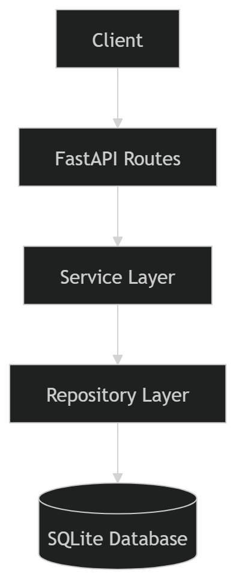

# Chat-Application

This project focuses on readable, well-structured code with clear separation of concerns, dependency injection, and tests.

---

##  Features

- Create public chat groups
- Join groups (public: any user can join any group)
- Send messages within a group
- List messages in a group (with pagination)
- Users identified via HTTP header (`X-User`) — no login/GUI required

---

##  Tech Stack

- Python 3.11+
- FastAPI
- SQLAlchemy 2.0
- SQLite
- Pydantic
- Pytest
- Uvicorn
- Docker

---

##  Architecture

Layered structure with separation of concerns:

